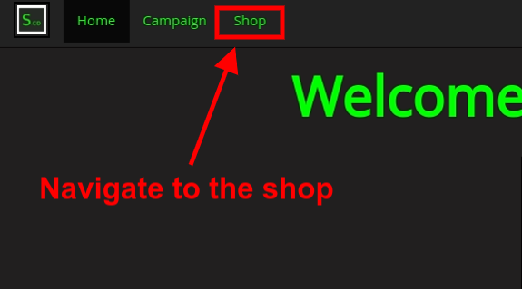
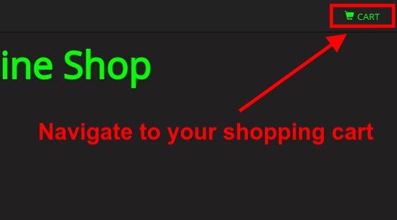
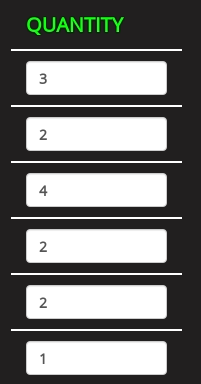

# Capstone Project :recycle:

## Description 
This is a website for an E-commerce business that I created for my Capstone-Project during my Full Stack Web Development course with HyperionDev.
It contains a home page, a recruitment page, an online shop page and a functional shopping cart. 

### Table of Contents :mag:
1. [Installation Instructions](#installation-instructions-package)
2. [Usage](#usage)

## Installation Instructions :package:
1. Click the green 'Code' dropdown button on the repository page
2. Click 'Download ZIP'
3. Wait for the ZIP file to finish downloading
4. Double-click on the downloaded ZIP file to open
5. Click 'Extract' and extract files to desktop
6. Installation complete

## Usage 

#### Navigate to the shop

#### Add items to your cart

#### Functional shopping cart

#### Adjust quantities

#### Calculates Cart totals

#### Apply functional discount coupons that adjust cart totals 

#### Apply functional delivery charges that adjust the cart totals

